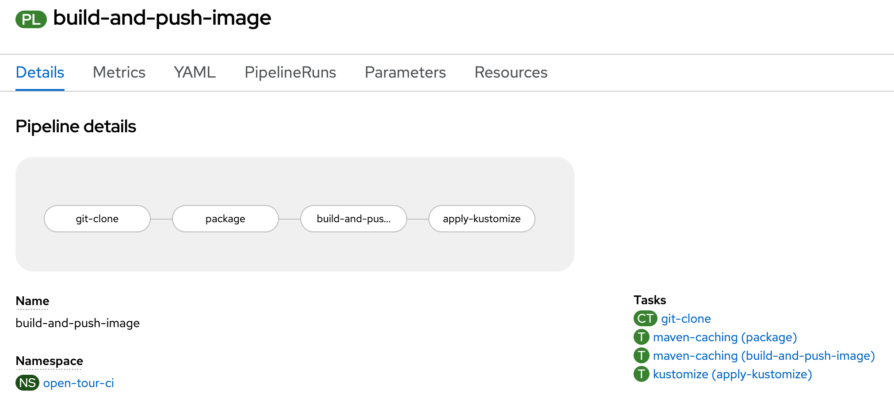

# Automate the automation - CI demo

## Overview

This repository contains a simple overview demo of **OpenShift Pipelines** (Tekton), including the new **Pipelines-as-code** feature.

The demo is based on parts from the excellent E-book **Getting GitOps** by Wanja Pernaut. Grab a copy yourself from the [Red Hat Developers community](https://developers.redhat.com/e-books/getting-gitops-practical-platform-openshift-argo-cd-and-tekton) .

There's two parts of the demo:

#### 1. Create and run Tekton pipeline in the cluster
  - Extend cluster with Tekton API's
  - Add Tekton `Pipelines` and `Tasks` to the cluster from manifests stored in Git ([./manifests/pipelines/](manifests/pipelines/))
  - Run simple Pipeline to test and build a Quarkus application and deploy it to a development environment in OpenShift



#### 2. Use `pipelines-as-code` to run pipelines in cluster
  - CI infrastructure dynamically created in cluster. Everything stored in Git. 
  - Integrated as a GitHub App, triggers on Pull Request events.
  - [.tekton/pull-request.yaml](./.tekton/pull-request.yaml)


## Demo time

### Prerequisites

- Installed OpenShift cluster (tested with 4.10)
- `cluster-admin` privileges (to install OpenShift Pipelines operator)
- Configured `settings.env` file environment details

### Install demo

Demo can be installed and configured with the included `demo.sh` script.

```bash
./demo.sh install
```

The install script will do the following:
- Install OpenShift Pipelines operator
- Add the `pipelines-as-code` component (currently tech preview)
- Create `open-tour-ci` namespace and install CI dependencies (Nexus)
- Create `open-tour-dev` namespace and install app servies (PostgreSQL)
- Create application `Pipeline` and custom `Tasks` to `open-tour-ci` namespace

### Start Pipeline

Start additional `PipelineRuns` with the demo script.

```bash
./demo.sh start
```


